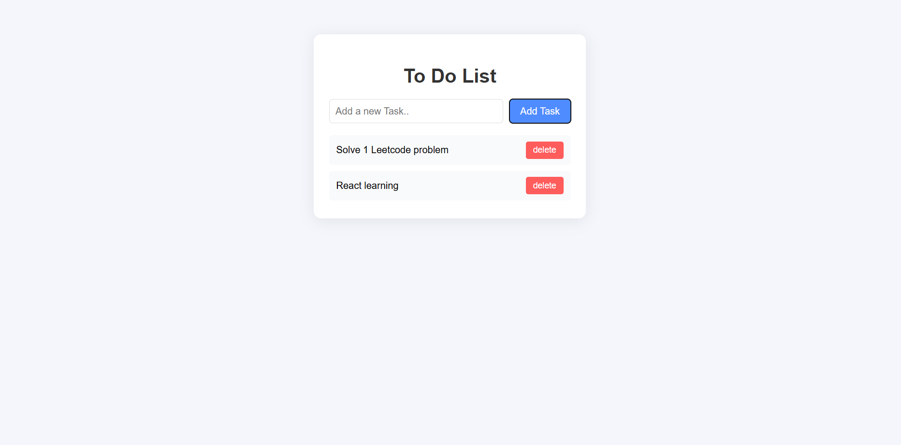

# ✅ Simple To-Do List App

A clean and functional to-do list application built with **vanilla JavaScript, HTML, and CSS**. This project demonstrates core JavaScript concepts, including DOM manipulation, event handling, and data persistence using `localStorage`. It's a classic project that showcases strong foundational web development skills.




---

## ✨ Features

-   **Add Tasks:** Quickly add new tasks to your list through a simple input field.
-   **Delete Tasks:** Remove tasks you no longer need with a dedicated delete button.
-   **Mark as Complete:** Click on a task to toggle its completed status, visually striking it through.
-   **Data Persistence:** Your to-do list is automatically saved to the browser's `localStorage`, so your tasks will be there when you return.
-   **Clean UI:** A minimalist and intuitive interface that is easy to use.

---

## 🛠️ Technologies Used

-   **HTML5**: For the structure and content of the application.
-   **CSS3**: For styling and layout.
-   **JavaScript (ES6+)**: For all the application logic, interactivity, and DOM manipulation.

---

## 💡 Core Concepts Demonstrated

This project is a practical application of several fundamental web development concepts:

-   **DOM Manipulation:** Dynamically creating, updating, and deleting HTML elements using JavaScript to reflect the current state of the to-do list.
-   **Event Handling:** Using `addEventListener` to capture user interactions like button clicks (add, delete) and task toggles.
-   **`localStorage` API:** Persisting user data by storing the tasks array in the browser's local storage, ensuring the list is saved between sessions.
-   **Array Methods:** Utilizing JavaScript array methods like `forEach`, `push`, and `filter` to manage the list of tasks efficiently.
-   **Data Attributes:** Using `data-id` attributes to associate DOM elements with their corresponding data objects, making it easy to update or delete specific tasks.

---

## 🚀 Getting Started

Since this is a vanilla web project, getting it running is incredibly simple.

1.  **Clone the repository:**
    ```sh
    git clone [https://github.com/your-username/js-todo-app.git](https://github.com/your-username/js-todo-app.git)
    ```
2.  **Navigate to the project directory:**
    ```sh
    cd js-todo-app
    ```
3.  **Open the `index.html` file:**
    Simply open the `index.html` file in your favorite web browser to start using the application. There are no build steps or dependencies required.

---

## 📄 License

This project is distributed under the MIT License. See `LICENSE` for more information.
